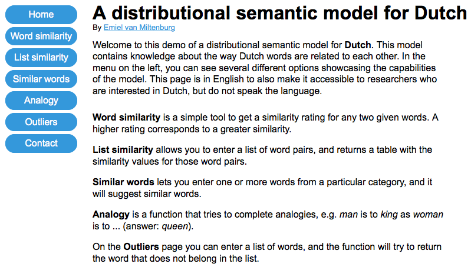

# Setting up the Website

This screen shot shows you what the website will look like, once running:

### Preliminaries
* To run the website, you need to have `Gensim` and `Flask` installed.
* Download a distributional model to `./data/`
* Modify `model_functions.py` so that the path to the model is correct.
* Run `python website.py` to start up local server in debug mode.

### Debugging
Standardly, the website will run in debug mode. This will give you feedback about the website in your console. If you are performing revisions to the website, you might want to comment the following code in `model_functions.py` as this part loads the entire model into memory.

    from gensim.models import Word2Vec

    path  = './data/dutch_vectors_nlcow14_300dims_skipgram.bin.gz'
    model = Word2Vec.load_word2vec_format(path, binary=True)

Then, uncomment the following piece of code. This will provide you with a dummy version of the actual model that will load much more quickly.

    # import random
    #
    # class dummy_model(object):
    #     vocab = {'appel':1,'hond':2,'kat':3}
    #     def similarity(self,x,y): return random.random()
    #     def most_similar(self, positive=None,negative=None): return [('sheep',5),('dog',3)]
    #     def doesnt_match(self, l): return 'beschuit'
    #
    # model = dummy_model()

### Deploying the website
For deployment information, see [the Flask documentation](http://flask.pocoo.org/docs/0.10/deploying/). Be sure to set `debug` to `False` on line 105-6 of `website.py`:

    if __name__ == "__main__":
        app.run(debug=True)
